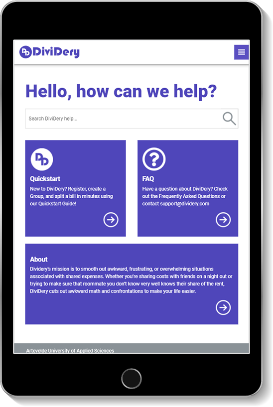
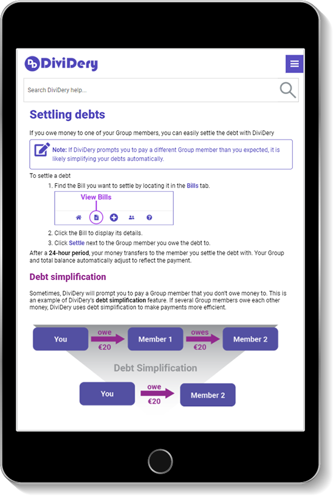
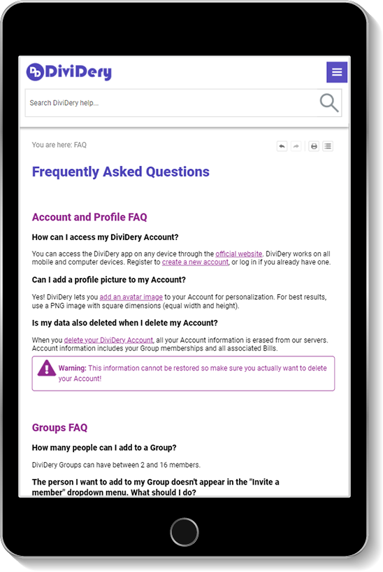

# Dividery Help Site

DiviDery is an app that lets you track, divide, and settle bills together, stress-free!
The DiviDery Help Site has everything you need to get up and running with DiviDery!

## Authors

- [Sarah Dungan](https://github.com/sdungan)
- [Jared Granger](https://www.linkedin.com/in/jaredagranger/)

## Screenshots

    
    
    

## Color Reference

| Color      | Hex                                                              |
| ---------- | ---------------------------------------------------------------- |
| White      |  #ffffff |
| Purple     |  #5e42c2 |
| Magenta    |  #91288d |
| Light Gray |  #d3d3d3 |

## Demo

- [Live Help Site dividery-support.onrender.com](https://dividery-support.onrender.com/Content/Home.htm)
- [Live Demo dividery.onrender.com](https://dividery.onrender.com)

## Client

MadCap Flare

